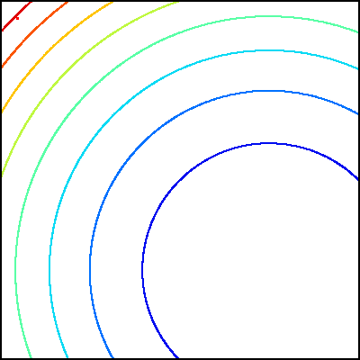

# apng

asdfasdf

| Tumble and swim steps of single bacterium | Swarm size controlled by attractant/repellant width |
| :--------------------------------------------------------------------------------------------------------------: | :----------------------------------------------------------------------------------------------------------------------------: |
|                 |                 |

| Chemotactic/reproduction/dispersal steps | 123 effect |
| :--------------------------------------------------------------------------------------------------------------: | :----------------------------------------------------------------------------------------------------------------------------: |
|                 |                 |